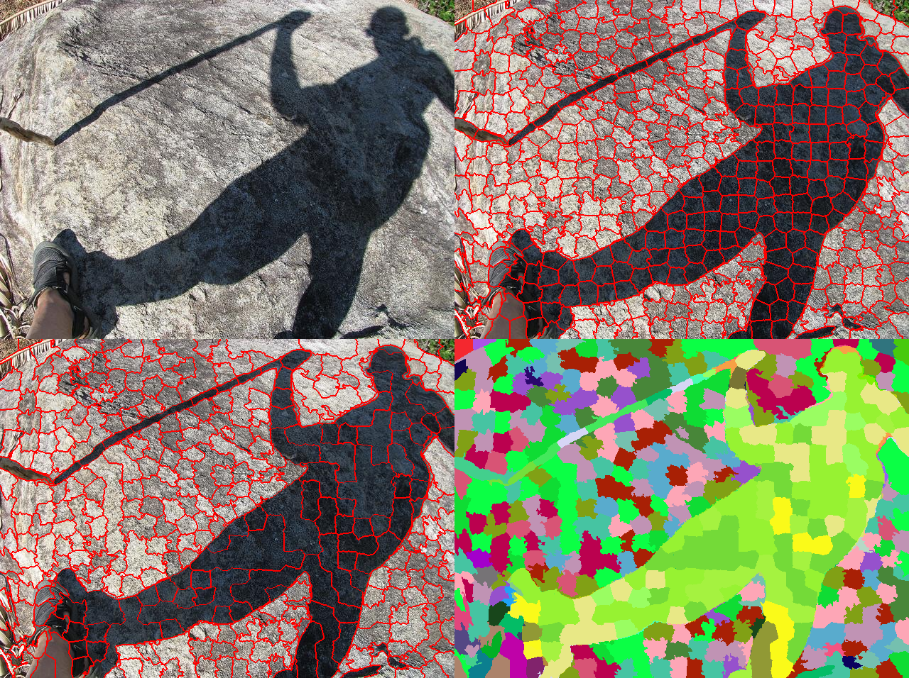
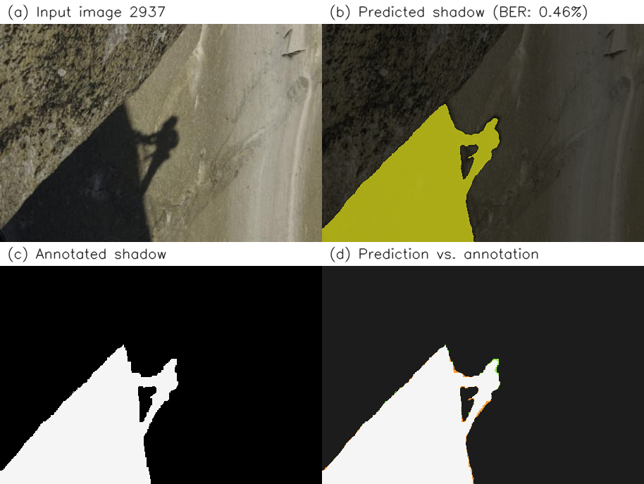
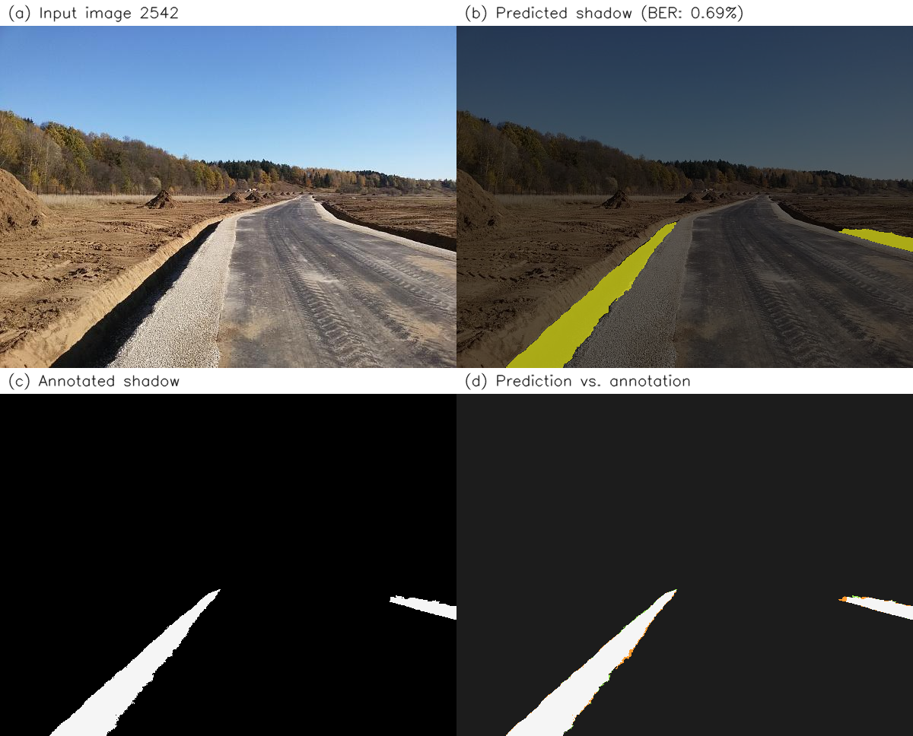
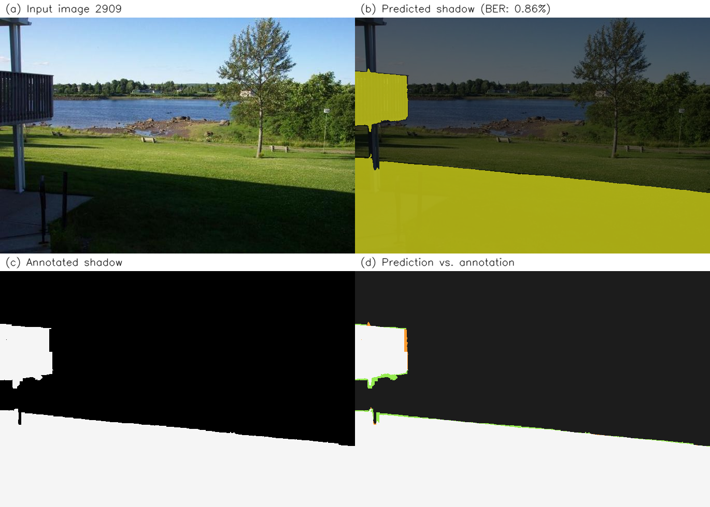

<h1 align="center">Leave-One-Out Kernel Optimization for Shadow Detection</h1>

<p align="center">
  <a href="https://openaccess.thecvf.com/content_iccv_2015/html/Vicente_Leave-One-Out_Kernel_Optimization_ICCV_2015_paper.html">
    
  </a>
</p>

<p align="center">
  
</p>

In this repository, we present a faithful reproduction of the ICCV 2015 paper **“Leave-One-Out Kernel Optimization for Shadow Detection”** (Vicente et al.). 
Our implementation follows the paper’s pipeline—from region-based features to joint kernel learning and optional contextual refinement—and is developed as the work for the **HKU MSc COMP7404** course project. Through this repository, we aim to make the original method accessible for reproduction and extension.
**This repository is the first open-source implementation of 
this paper to our best knowledge.**

## 🌑 Background: Why Shadow Detection Matters

Shadows are ubiquitous in outdoor and indoor imagery. Detecting them accurately supports higher-level vision tasks such as object recognition, scene understanding and image editing. Yet shadows are challenging: they alter appearance without a simple intensity cue, interact with illumination and surface materials, and often blend gradually with lit regions. Region-based approaches that combine color, texture and context remain a principled way to address these ambiguities.

## 🔬 Methodology: LooKOP

We adopt a **region-centric** design. First, we **oversegment** each image with SLIC superpixels, then **merge** superpixels into larger regions via Mean-shift clustering in LAB space, as in the original paper. 
Each region is described by **CIELAB histograms** and **MR8 texton** statistics, enabling multi-channel kernel comparisons.

**Leave-One-Out Kernel Optimization (LooKOP)** is the core of our system. We use a **Least-Squares SVM (LSSVM)** with a **multi-kernel** structure over the L\*, a\*, b\*, and texton channels. Instead of hand-tuning kernel weights and bandwidths, we **jointly optimize** them by minimizing a **closed-form Leave-One-Out balanced error** under a beam-search schedule, so hyperparameters are chosen to generalize well on the training regions.

Finally, we optionally apply a **Markov Random Field (MRF)** stage that combines unary potentials from calibrated region scores with **pairwise affinities** derived from kernel similarity, refining predictions with **QPBO**-style energy minimization. Together, segmentation, LooKOP and MRF form the end-to-end story we reproduce.

## ⭐ Core Advantages

- ⚡ **Efficient LSSVM solver**: We solve for support values and bias via a linear system, avoiding iterative inner loops for the classifier itself.
- 🚀 **GPU acceleration**: Distance and kernel computations can leverage PyTorch CUDA for large region sets.
- 📐 **Closed-form LOO error**: We evaluate leave-one-out residuals without retraining from scratch, enabling fast kernel selection during beam search.
- 📥 **Dataset handling**: We integrate loading (and optional download) of the SBU-Shadow dataset for reproducible experiments.
- 🔄 **Full preprocessing stack**: SLIC, Mean-shift regions, paper-style LAB and texton features, Platt calibration, and MRF post-processing are wired into a single training script.

## 📂 Repository Structure

```text
.
├── baseline/               # Baseline methods (Unary/MK-SVM kernels, region CNN)
├── data/                   # Dataset loader; local SBU data under data/sbu/ (git-ignored)
├── models/                 # LSSVM, multi-kernel, LOO beam search, distances, Platt, MRF
├── preprocessing/          # SLIC, Mean-shift regions, features, MR8 textons
├── utils/                  # Shared utilities
├── output/                 # Training outputs and visualizations (git-ignored by default)
├── train_sbu.py            # Main entry: SBU training, evaluation, and optional baselines
├── config.py               # Auxiliary configuration (optional)
├── requirements.txt
└── README.md
```

## 🛠️ Reproduction Guide

### 1. Installation

1. **Clone the repository**:
   ```bash
   git clone https://github.com/xiaomomy/Shadow.git
   cd Shadow
   ```

2. **Install dependencies** (Python 3.8+; CUDA optional but recommended for speed):
   ```bash
   pip install -r requirements.txt
   ```

### 2. Running the Full Pipeline

We consolidate our formal experiment in **`train_sbu.py`**. 
After placing or downloading the SBU-Shadow dataset under the 
expected paths (see `data/dataset_loader.py`), run:

```bash
python train_sbu.py
```

## 📊 Reproduction Results

### 1. Reproduction Setup

We conduct our main experiments on the SBU-Shadow dataset. We sample **60 training images** (yielding approximately 15,000 regions) to train LooKOP and the baseline methods, and we hold out **60 images** for pixel-level evaluation. We align key hyperparameters—such as SLIC superpixel count, Mean-shift bandwidth, and beam-search iterations—with the original paper’s settings via the **`CONFIG`** dictionary in `train_sbu.py`. To streamline reproduction, we automatically cache computationally expensive artifacts (e.g., the texton dictionary and extracted region features) to `output/cache/` and save trained models together with visualizations to `output/sbu_formal/` by default. You can adjust these paths directly in `CONFIG` to match your local setup.

### 2. Quantitative Results

We report **pixel-level** false positive rate (FPR), false negative rate (FNR), and balanced error rate (BER) on our SBU hold-out evaluation. Metrics are computed by expanding region predictions to pixels against ground-truth masks.

<div align="center">

| Method | Pixel FPR (%) | Pixel FNR (%) | Pixel BER (%) |
| :--- | :---: | :---: | :---: |
| Unary SVM | 4.58 | 37.00 | 20.79 |
| MK-SVM | 2.73 | 54.04 | 28.39 |
| ConvNet (CNN) | 7.84 | 36.52 | 22.18 |
| **LooKOP (Ours)** | 6.59 | **15.75** | **11.17** |

</div>

### 3. Visual Gallery

We present several qualitative examples produced by LooKOP to intuitively
dmonstrate its accuracy of shadow prediction.

<div align="center">
  <p><strong>Example 1</strong></p>
  
  <br><br>
  
  <hr width="50%" style="margin: 20px auto;">
  
  <p><strong>Example 2</strong></p>
  
  <br><br>
  
  <hr width="50%" style="margin: 20px auto;">
  
  <p><strong>Example 3</strong></p>
  
</div>


## 🙏 Acknowledgements
Our repository builds entirely on the methodology and experimental spirit of Vicente et al. We are grateful to the authors for their clear formulation of leave-one-out kernel optimization for shadow detection and for the foundations it provides for reproducible research.

If you use ideas or code derived from this reproduction, please cite the original paper:

```bibtex
@inproceedings{vicente2015leave,
  title={Leave-one-out kernel optimization for shadow detection},
  author={Vicente, Tom{\'a}s F Yery and Hou, Le and Samaras, Dimitris and Hoai, Minh and Nguyen, Minh-Hoai},
  booktitle={Proceedings of the IEEE International Conference on Computer Vision (ICCV)},
  pages={3388--3396},
  year={2015}
}
```
